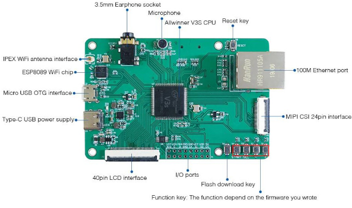
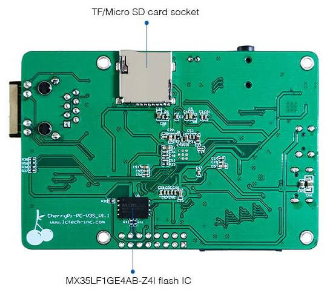

# meta-cherrypi-v3s

## Instruction how to build an image for Cherrypi based on Allwinner V3s in Yocto

### Products:

Home page 
http://www.lctech-inc.com/cpzx/LCPIxl/2021/1009/532.html  

  
  
Cherry Pi V3s Version  
 

## General Note:
Assumed that Linux Ubuntu is installed

## List of tested elements
Example application for GPIO handling

## List of not tested elements
Lcd  
Touchscreen  

TBD  

## How to build an images

1. First make sure the following packages are installed in the system

    ***sudo apt-get install gawk wget diffstat unzip texinfo gcc-multilib build-essential chrpath socat libsdl1.2-dev xterm emscripten libmpc-dev libgmp3-dev swig zstd lz4***

    **Note:**
    More information can be found on the Yocto reference manual.
    For Windows WSL try to set UTF8
    ***sudo locale-gen en_US en_US.UTF-8; sudo dpkg-reconfigure locales***

3. Download the necessary Yocto package listed below. Be sure to be in the root of the home folder.

	***mkdir yocto*** 
	***cd yocto***  
	***mkdir build***  
	***git clone git://git.yoctoproject.org/poky --depth 1 -b scarthgap***  
        ***cd poky***  
	***git clone git://git.openembedded.org/meta-openembedded --depth 1 -b scarthgap***  
	***git clone https://github.com/meta-qt5/meta-qt5.git --depth 1 -b scarthgap***  
	***git clone https://github.com/voloviq/meta-cherrypi-v3s --depth 1 -b scarthgap***  

4. Select a directory to build Linux

	***source oe-init-build-env ~/yocto/build/cherrypi-v3s***  

5. Modify bblayers.conf(located in ~/yocto/build/cherrypi-v3s/conf)

    *BBLAYERS ?= " \\\
      ${HOME}/yocto/poky/meta \\\
      ${HOME}/yocto/poky/meta-poky \\\
      ${HOME}/yocto/poky/meta-openembedded/meta-oe \\\
      ${HOME}/yocto/poky/meta-openembedded/meta-networking \\\
      ${HOME}/yocto/poky/meta-openembedded/meta-python \\\
      ${HOME}/yocto/poky/meta-openembedded/meta-multimedia \\\
      ${HOME}/yocto/poky/meta-qt5 \\\
      ${HOME}/yocto/poky/meta-cherrypi-v3s \\\
      "* 

    **Note:** Please adapt PATH of conf/bblayers.conf if necessary.  

6. Modify local.conf(located in ~/yocto/build/cherrypi-v3s/conf) file

    - modify line with "MACHINE ??" to add "cherrypi-v3s-sdcard" or for SPI NOR Flash "cherrypi-v3s-spinor"

    - align *DL_DIR = "${HOME}/yocto/downloads"*  

    - align *SSTATE_DIR = "${HOME}/yocto/sstate-cache"*  
    
    - align *TMPDIR = "${HOME}/yocto/tmp"*  
    
    - add at the end the following records    
    	*RM_OLD_IMAGE = "1"*  
	*INHERIT += "rm_work"*  
	*MACHINEOVERRIDES .= ":use-mailine-graphics"*  
	*LICENSE_FLAGS_ACCEPTED = "commercial"*  
	
    - for spi flash change DISTRO ?= "poky" to DISTRO ?= "cherrypi-v3s-tiny"  

    **Note:** Please adapt the rest of conf/local.conf parameters if necessary.  

7. Build objects

    - When using SPI NOR Flash use the following image
    - core image minimal  
      ***bitbake core-image-minimal***  

    - console image  
      ***bitbake console-image***  

    - qt5 image  
      ***bitbake qt5-image***  

    - qt5 toolchain sdk  
      ***bitbake meta-toolchain-qt5***  

8. After compilation images appear in

    Nano version  
	*~/yocto/tmp/deploy/images/cherrypi-v3s*  

9. Insert SD CARD into the dedicated CARD slot and issue the following command to write an image

    **Note:**  
    Be 100% sure to provide a valid device name (**of=/dev/sde/mmcblk0**). The wrong name "/dev/sde/mmcblk0" damages Your system file!    
        Nano version  
    	***sudo dd if=~/yocto/tmp/deploy/images/cherrypi-v3s-sdcard/core-image-minimal-cherrypi-v3s-sdcard.sunxi-sdimg of=/dev/mmcblk0 bs=1024***  

10. SPI NOR Flash update tool compilation(if valid sunxi-tools installed go to point 10) 
    ***git clone https://github.com/Icenowy/sunxi-tools.git -b v3s-spi*** 
    ***sudo apt-get install libz libusb-1.0-0-dev*** 
    ***make*** 
    ***sudo make install*** 

11. Flash SPI NOR flash 
    To enter into bootloader mode, erase the u-boot section from spi nor flash. 
    To do this it is necessary to stop booting U-Boot and enter the following commands. 
    ***sf probe 0*** 
    ***sf erase 0 70000*** 
    ***sunxi-fel -p spiflash-write 0 ~/yocto/tmp/deploy/images/cherrypi-v3s-spinor/core-image-minimal-cherrypi-v3s-spinor.sunxi-spinor*** 
    To write only u-boot...spl just type 
    ***sudo sunxi-fel -v uboot u-boot-sunxi-with-spl.bin*** 

12. How to handle GPIO from userfs - example (used PE3 as GPIO) 

    1. Take a GPIO for instance PE3 
    ***echo 131 > /sys/class/gpio/export*** 
    2. Set as out or in 
    ***echo "out" > /sys/class/gpio/gpio131/direction*** 
    3. Set GPIO state if configured as ouput 
    ***echo 1 > /sys/class/gpio/gpio131/value*** 
    ***echo 0 > /sys/class/gpio/gpio131/value*** 
    
# Limitation
	
